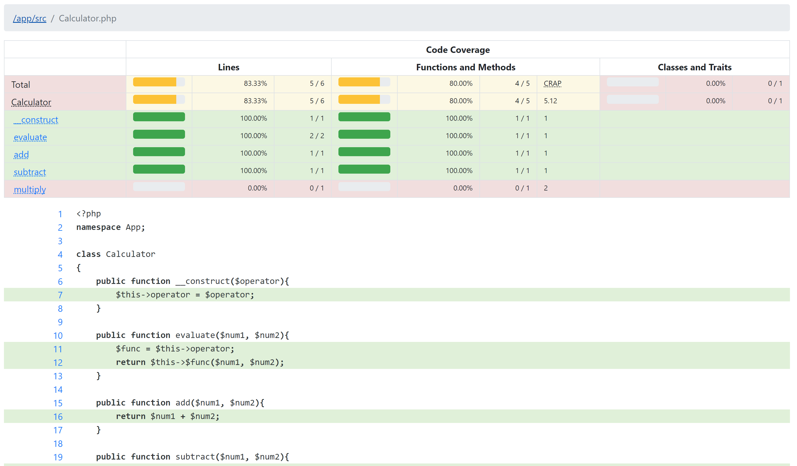
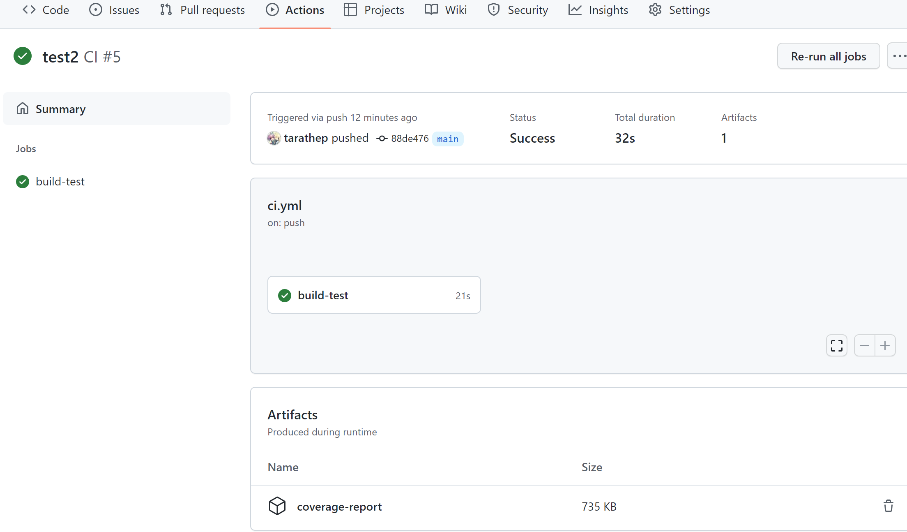

# PHP Unit Test


Unitest with PHP Unit + Code coverage

PHPUnit is a programmer-oriented testing framework for PHP.
It is an instance of the xUnit architecture for unit testing frameworks

https://phpunit.de/

## Example Report




Download Depenencies via Composer
```bash
composer install
```

Run Unit Test on local
```bash
./vendor/bin/phpunit tests
```

Run on GitHub Workflow



